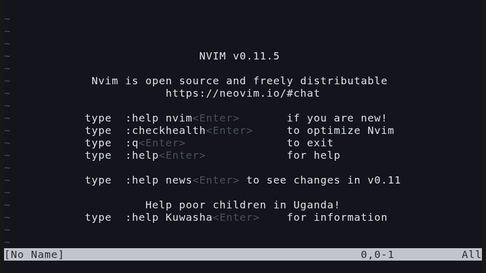

# mini-pick-preview.nvim

> ⚠️ **This project is currently under development.**

Standalone preview window for [mini.pick](https://github.com/nvim-mini/mini.nvim).



## Overview

`mini-pick-preview.nvim` extends mini.pick with an independent, always-visible preview window displayed on the right side. Unlike mini.pick's native single-window design where TAB toggles preview mode, this plugin provides a persistent preview window for a more comfortable browsing experience.

## Installation

Use your preferred plugin manager.

## Setup

Initialize in your Neovim configuration:

```lua
require('mini-pick-preview').setup()
```

That's it. The preview window appears automatically on the right side whenever mini.pick is active.

## Features

- ✨ Automatic preview window on the right side
- 🎨 Inherits picker's border and highlight styles
- 🎯 Works with all mini.pick built-in pickers (files, buffers, etc.)
- ⚡ Lightweight and non-intrusive

## Requirements

- mini.nvim (mini.pick module)

