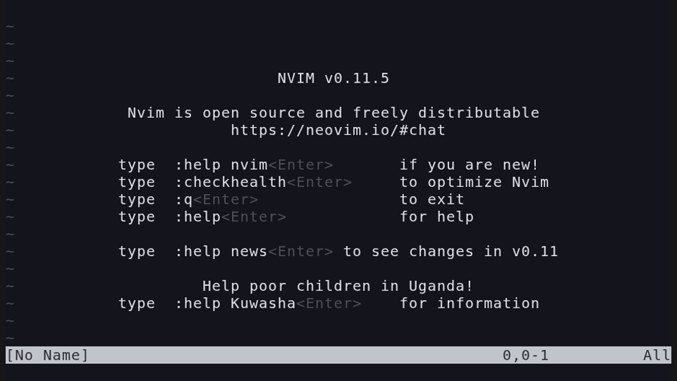

# mini-pick-preview.nvim

Standalone preview window for [mini.pick](https://github.com/nvim-mini/mini.nvim).



## Overview

`mini-pick-preview.nvim` extends mini.pick with an independent, always-visible preview window displayed on the right side. Unlike mini.pick's native single-window design where TAB toggles preview mode, this plugin provides a persistent preview window for a more comfortable browsing experience.

## Installation

Use your preferred plugin manager.

## Setup

Initialize in your Neovim configuration:

```lua
require('mini-pick-preview').setup()
```

That's it. The preview window appears automatically on the right side whenever mini.pick is active.

## Features

- ✨ Automatic preview window on the right side
- 🎨 Inherits picker's border and highlight styles
- 🎯 Works with all mini.pick built-in pickers (files, buffers, etc.)
- ⚡ Lightweight and non-intrusive

## Requirements

- mini.nvim (mini.pick module)

## Troubleshooting

### Preview window is hidden behind mini.pick's main window (search window)

When using certain configurations, the preview window may be hidden behind mini.pick's main window (search window).

The preview window's position is calculated based on the search window's configuration values. In the example below, the search window's `col` is `0`, but it is actually drawn at position `52`. `52` is the sum of `width + border`.

```lua
require("mini.pick").setup({
  window = {
    config = {
      width = 50,
      anchor = "NE",
    },
  },
})
```

If the preview window is hidden behind the search window, please explicitly specify `col`, `width`, and `anchor` in mini.pick's setup.

### Dynamic window size adjustment

When using a fixed `width` configuration, the picker window always uses the same width regardless of the terminal size. This can cause layout issues if the terminal is resized.

To adjust the picker window size dynamically each time the picker is opened, pass a **function** instead of a static value for the `config` option. The function is evaluated every time the picker starts, allowing it to adapt to the current terminal width:

```lua
require("mini.pick").setup({
  window = {
    config = function()
      return {
        width = math.floor((vim.o.columns - 8) / 2),
      }
    end,
  },
})
```

This approach ensures the picker always uses an appropriate width based on the current terminal size, preventing the preview window from overlapping.

